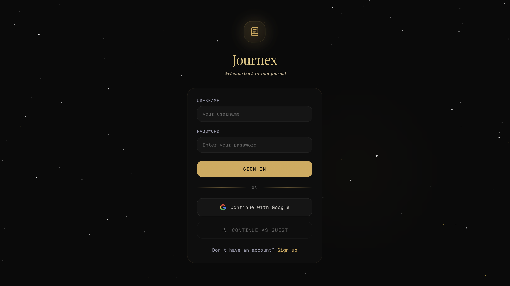
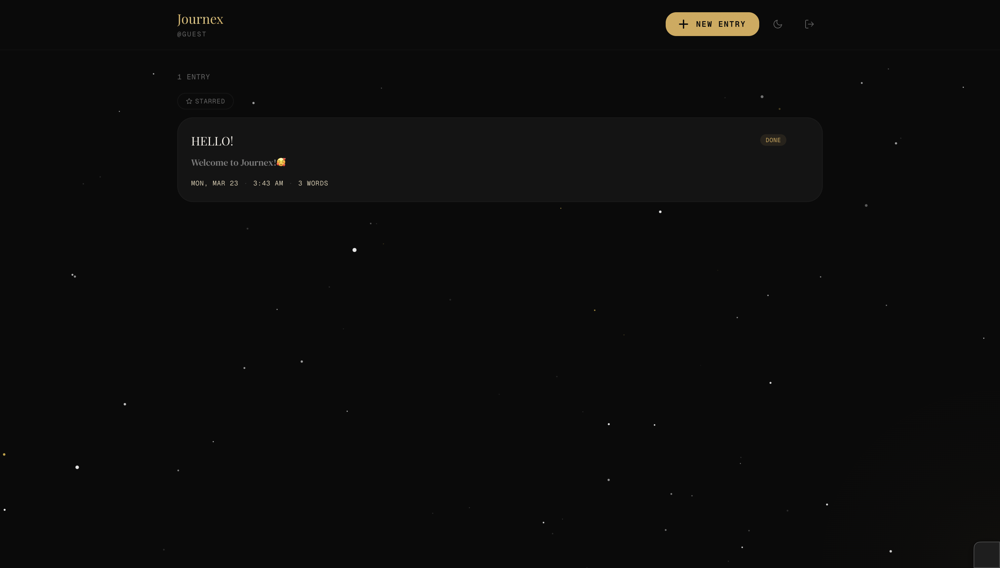
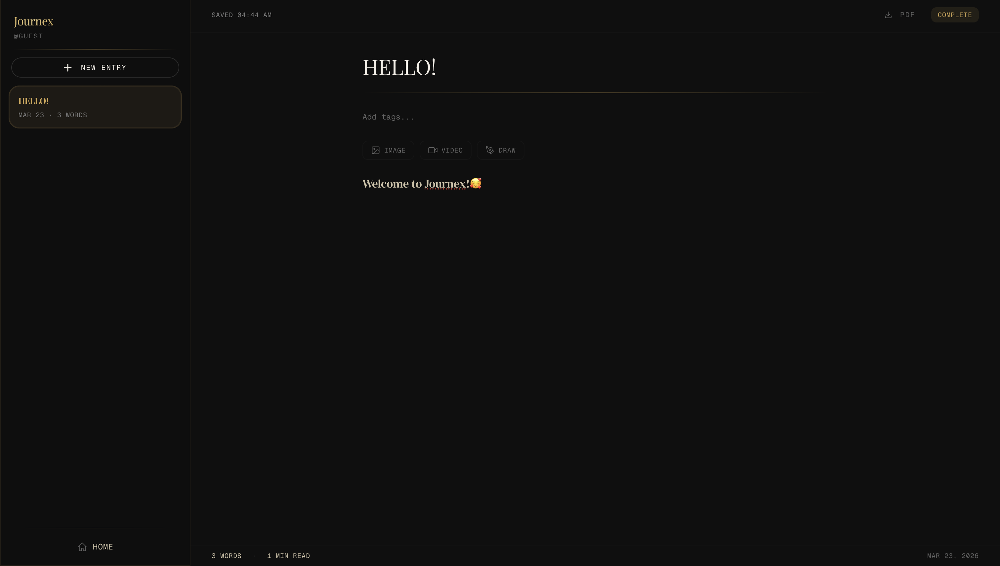
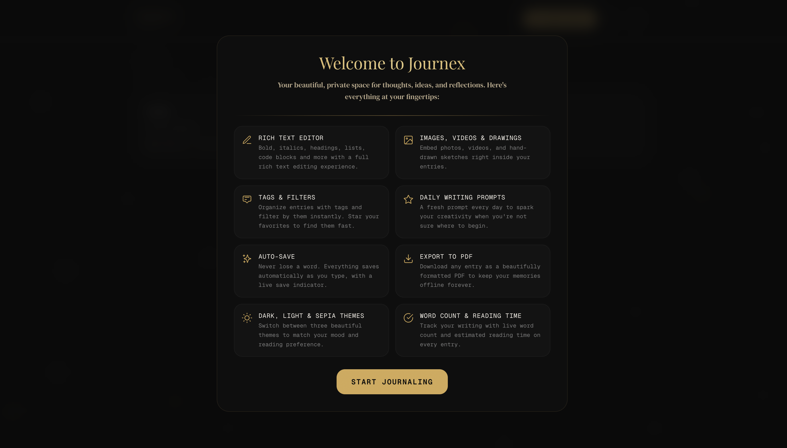
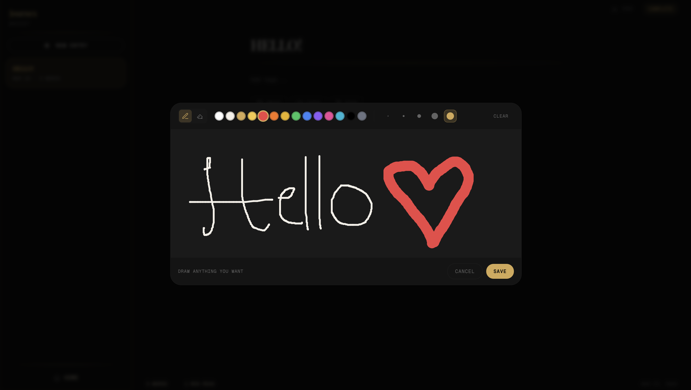
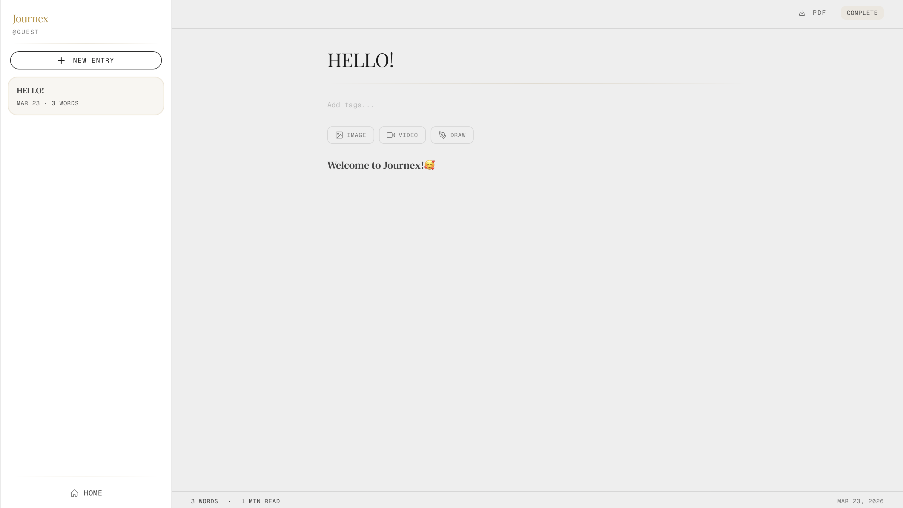
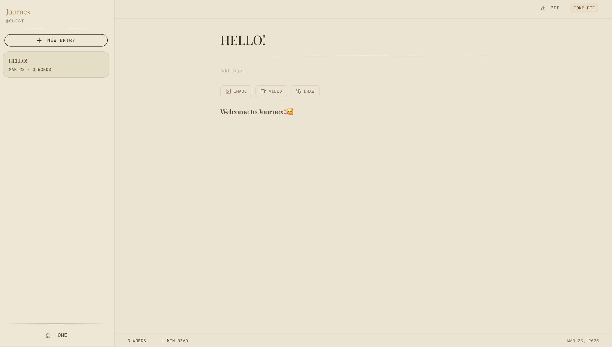
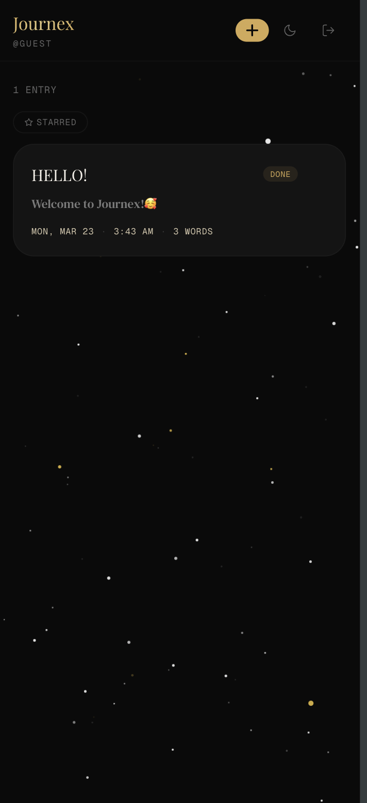

# Journex

A premium, dark-themed personal journaling app built with Next.js 14 and Supabase. Write rich entries with inline images, videos, and hand-drawn sketches. Organize with tags, star your favorites, export to PDF, and switch between dark, light, and sepia themes.

LIVE AT https://journex-three.vercel.app/login


## Screenshots

### Login


### Journal Home


### Rich Text Editor


### Welcome Banner


### Drawing Canvas


### Themes



### Mobile


## Features

**Rich Text Editor**
Full formatting with bold, italics, headings, lists, blockquotes, and code blocks powered by TipTap. Everything saves automatically as you type.

**Inline Media**
Insert images, videos, and hand-drawn sketches directly between your text. The drawing canvas comes with 14 colors, 5 brush sizes, and an eraser tool.

**Tags & Favorites**
Add tags to any entry and filter by them from the home view. Star your important entries so they're always one tap away.

**Daily Writing Prompts**
A fresh writing prompt every day appears as your editor placeholder, so you always have a starting point when you're not sure what to write.

**PDF Export**
Download any journal entry as a cleanly formatted PDF with your title, date, tags, word count, and full content. Images and drawings are included.

**Three Themes**
Switch between dark, light, and sepia themes. Your preference persists across sessions.

**Word Count & Reading Time**
Live word count and estimated reading time shown at the bottom of every entry.

**Guest Mode**
Try the app without signing up. Click "Continue as Guest" on the login page and start writing immediately.

**Auto-Save**
Entries save automatically as you type with a live indicator showing the save status. Never lose a word.

**Responsive Design**
Works on desktop and mobile. The sidebar collapses on small screens, the editor adapts, and the drawing canvas wraps its toolbar for touch devices.

## Tech Stack

| Layer | Technology |
|-------|-----------|
| Framework | Next.js 14 (App Router) |
| Language | TypeScript |
| Database | Supabase (PostgreSQL) |
| Auth | Supabase Auth (email, Google OAuth, guest) |
| Editor | TipTap v2 (rich text, images, custom video node) |
| Styling | Tailwind CSS with custom color palette |
| Animations | Framer Motion |
| PDF Export | jsPDF + html2canvas (dynamically imported) |
| Validation | Zod |
| Fonts | Playfair Display, DM Serif Text, Geist Mono |

## Project Structure

```
journex/
├── app/
│   ├── api/
│   │   ├── auth/
│   │   │   ├── guest/          # Guest login endpoint
│   │   │   ├── register/       # User registration
│   │   │   └── set-password/   # Password setup
│   │   └── entries/
│   │       └── [id]/           # Single entry CRUD
│   ├── auth/
│   │   ├── callback/           # OAuth callback
│   │   └── setup-profile/      # Post-auth profile setup
│   ├── journal/                # Main journal page
│   ├── login/                  # Login page
│   ├── signup/                 # Signup page
│   ├── layout.tsx              # Root layout (server component)
│   ├── page.tsx                # Redirects to /login
│   └── globals.css             # Themes, animations, effects
├── components/
│   ├── auth/                   # LoginForm, RegisterForm, GoogleSignIn
│   ├── journal/                # EntryEditor, Sidebar, DrawingCanvas, etc.
│   ├── effects/                # StarField, CursorGlow, GrainOverlay
│   └── ui/                     # Button, Input, Spinner
├── hooks/
│   ├── useAutoSave.ts          # Debounced auto-save logic
│   ├── useJournal.ts           # Entry CRUD operations
│   ├── useStarred.ts           # localStorage-based favorites
│   └── useTheme.ts             # Theme cycling and persistence
├── lib/
│   ├── supabase/               # Server, client, admin, middleware clients
│   ├── tiptap/                 # Custom video node extension
│   ├── validations/            # Zod schemas for auth and entries
│   ├── demo-user.ts            # Guest/demo user management
│   └── export-pdf.ts           # PDF generation logic
├── types/
│   ├── api.ts                  # API request/response types
│   ├── database.types.ts       # Supabase table types
│   └── hooks.ts                # Hook return types
├── supabase-schema.sql         # Database schema (run in Supabase SQL editor)
└── tailwind.config.ts          # Custom obsidian/amber/cream palette
```

## Getting Started

### Prerequisites

You need a [Supabase](https://supabase.com) project. The free tier works fine.

### 1. Clone and install

```bash
git clone https://github.com/your-username/my-journals.git
cd my-journals/journex
npm install
```

### 2. Set up the database

Go to your Supabase dashboard, open the **SQL Editor**, and run the contents of `supabase-schema.sql`. This creates:

  - `profiles` table (linked to Supabase auth users)
  - `journal_entries` table with tags, word count, and completion status
  - Auto-profile creation trigger on user signup
  - Row Level Security policies so users only see their own data
  - Indexes for performance

### 3. Configure environment variables

Copy the example env file and fill in your Supabase credentials:

```bash
cp .env.example .env.local
```

```env
NEXT_PUBLIC_SUPABASE_URL=https://your-project.supabase.co
NEXT_PUBLIC_SUPABASE_ANON_KEY=your-anon-key
NEXT_PUBLIC_SITE_URL=http://localhost:3000
SUPABASE_SERVICE_ROLE_KEY=your-service-role-key
```

You'll find the URL and keys in your Supabase dashboard under **Settings > API**.

### 4. (Optional) Enable Google OAuth

In your Supabase dashboard, go to **Authentication > Providers > Google** and configure it with your Google Cloud OAuth credentials. Set the redirect URL to:

```
https://your-project.supabase.co/auth/v1/callback
```

### 5. Run the dev server

```bash
npm run dev
```

Open **http://localhost:3000** in your browser.

### 6. First use

You have three ways to get in:

  - **Sign up** with a username and password
  - **Google login** if you configured OAuth
  - **Continue as Guest** to try the app without an account

## Database Schema

```sql
-- Profiles (auto-created on signup via trigger)
profiles
  ├── id            uuid (PK, references auth.users)
  ├── username      text (unique)
  ├── display_name  text
  ├── avatar_url    text
  ├── has_password  boolean
  ├── created_at    timestamptz
  └── updated_at    timestamptz

-- Journal entries
journal_entries
  ├── id                   uuid (PK, auto-generated)
  ├── user_id              uuid (FK to profiles)
  ├── title                text (default: 'Untitled')
  ├── content              text (HTML from TipTap)
  ├── content_text         text (plain text for search)
  ├── tags                 text[] (array)
  ├── word_count           integer
  ├── is_complete          boolean
  ├── last_edited_section  text
  ├── created_at           timestamptz
  └── updated_at           timestamptz
```

Row Level Security is enabled on both tables. Users can only access their own data. The service role key (used server-side for guest accounts) bypasses RLS.

## API Routes

| Method | Endpoint | Description |
|--------|----------|-------------|
| POST | `/api/auth/register` | Create a new account |
| POST | `/api/auth/guest` | Create or retrieve guest credentials |
| POST | `/api/auth/set-password` | Set password for OAuth users |
| GET | `/api/entries` | List all entries for the current user |
| POST | `/api/entries` | Create a new entry |
| GET | `/api/entries/[id]` | Get a single entry |
| PATCH | `/api/entries/[id]` | Update an entry (auto-save uses this) |
| DELETE | `/api/entries/[id]` | Delete an entry |

```

## License

MIT
